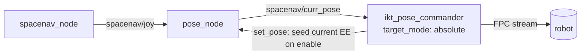
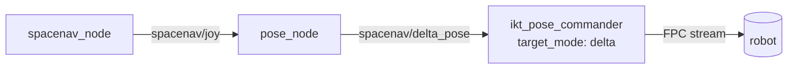

# SpaceMouse teleop migration — adopt `pose_node`, retire `spacemouse_teleop`

**Status:** SUPERSEDED 2026-06-26 — the original plan (commander reads the
SpaceMouse pose topics directly; absolute **and** delta; `set_pose` seeding) was
later REPLACED at the user's request: **delta control removed** from the commander
(absolute target pose only, so it always tracks the latest pose and may drop
intermediate ones), and the SpaceMouse→commander adaptation moved into a dedicated
translator package, **`spacemouse_teleop`** (Plan A; first built as
`spacemouse_pose_bridge`, then renamed back to the retired package's name).
Current design:
[src/spacemouse_teleop/README.md](src/spacemouse_teleop/README.md) + the
`ikt_pose_commander` README. This file is kept as the analysis record (see §12).
**Date:** 2026-06-26
**Trigger:** `3dconnexion_ros2` gained a pose-output node (`pose_node`) on its
`delta` branch. It now does, upstream, the twist→pose integration that our
`spacemouse_teleop` bridge was built to do — so the bridge is largely redundant
and `ikt_pose_commander` can consume the SpaceMouse pose directly.

---

## 1. TL;DR

- The updated submodule publishes ready-to-use poses from the puck:
  - `spacenav/curr_pose` — **accumulated absolute pose** (`PoseStamped`)
  - `spacenav/delta_pose` — **per-tick increment** (`PoseStamped`)
  - `spacenav/set_pose` — **reset** the accumulated pose (subscribed)
- Its integration math is **identical** to our old `twist_integrator` *and* to
  the commander's existing `_apply_delta`. So the bridge adds nothing
  mathematically anymore.
- **Recommended target architecture (matches the user's request):**
  `pose_node → spacenav/curr_pose → ikt_pose_commander (absolute mode)`, with the
  commander publishing `spacenav/set_pose` to **seed the puck's pose to the
  robot's current end-effector on enable** (the "update the target pose if
  needed" piece). `spacemouse_teleop` is deleted.
- A **delta variant** (`spacenav/delta_pose → ~/target_delta`) needs *zero* new
  commander code and is the lowest-risk fallback. Wiring **both** topics lets a
  single live `target_mode` switch choose between them.
- The only genuinely new code is a small, well-contained **`set_pose` seeding
  handshake** in the commander (≈40 lines) plus launch/config wiring and
  doc/cleanup.

---

## 2. What changed in `3dconnexion_ros2`

Submodule is on branch **`delta`** (`origin/delta`, `479c022`). `main`
(`21934a4`) does **not** have the pose node yet.

New file: [external/3dconnexion_ros2/spacemouse/spacemouse/pose_node.py](external/3dconnexion_ros2/spacemouse/spacemouse/pose_node.py)
(entry point `pose_node` is registered in
[external/3dconnexion_ros2/spacemouse/setup.py](external/3dconnexion_ros2/spacemouse/setup.py)).

`PoseNode`:

- Subscribes `spacenav/joy` (the normalized 6-DOF axes from the `spacenav`
  driver), integrates them at a fixed rate, and publishes every tick:
  - `spacenav/curr_pose` (`PoseStamped`) — running accumulation
  - `spacenav/delta_pose` (`PoseStamped`) — the single-tick delta
- Subscribes `spacenav/set_pose` (`PoseStamped`) to jump `curr_pose` to an
  explicit value and keep integrating from there.
- Parameters (all live via `ros2 param set` or the dashboard sliders):

  | Param | Default | Meaning |
  |-------|---------|---------|
  | `publish_frequency` | `100.0` | output rate (Hz) |
  | `max_trans_speed` | `0.1` | m/s at full axis deflection |
  | `max_rot_speed` | `1.0` | rad/s at full axis deflection |
  | `integration_frame` | `world` | accumulate in `world` or `body` frame |
  | `pose_frame_id` | `spacenav_origin` | `header.frame_id` of the poses |
  | `input_topic` | `spacenav/joy` | source axes |
  | `deadzone` | `0.0` | ignore `|axis| <` this |
  | `input_timeout` | `0.5` | zero input if `joy` goes stale (s) |
  | `publish_tf` | `false` | also broadcast `curr_pose` on `/tf` |

- It runs **by default** from
  [external/3dconnexion_ros2/spacemouse/launch/spacemouse.launch.py](external/3dconnexion_ros2/spacemouse/launch/spacemouse.launch.py)
  (`enable_pose:=true`), which also exposes
  `pose_frequency` / `max_trans_speed` / `max_rot_speed` / `integration_frame`
  as launch args, independent of the web dashboard.

### Per-tick magnitude

`d_trans = axis × max_trans_speed / publish_frequency` and likewise for
rotation — e.g. `0.1 m/s ÷ 100 Hz = 1 mm` per message at full deflection. Centred
puck → zero delta → `curr_pose` holds (and `delta_pose` = identity).

---

## 3. Why the bridge is now redundant — math equivalence

The three integrators are the **same** rigid-body composition (verified by
reading the code):

| Concept | `pose_node` | old servo `twist_integrator` | commander `_apply_delta` |
|---|---|---|---|
| world / base-frame increment | `integration_frame: world` (`p+dp`, `dq⊗q` left-mul) | `jog_frame: base` | `delta_frame: base` |
| body / tool-frame increment | `integration_frame: body` (`p+R(q)·dp`, `q⊗dq` right-mul) | `jog_frame: tool` | `delta_frame: tool` |

- `delta_pose` is the **raw per-tick puck delta** (frame-agnostic); whichever
  consumer applies it picks the frame. This is exactly what the commander's
  `_on_target_delta` already does with `delta_frame`.
- `curr_pose` is that same delta **accumulated** inside `pose_node`, expressed in
  `pose_frame_id`.

We previously proved (`tmp/delta_math_check.py`) that the commander's
`_apply_delta` reproduces the servo's `integrate_pose` to 0 µm / 0 m°. Since
`pose_node` uses the identical formulas, **the bridge's integration is now done
upstream**.

---

## 4. Audit of `spacemouse_teleop` — redundant vs. lost

Current package: [src/spacemouse_teleop](src/spacemouse_teleop) — `servo_node.py`
(twist→delta), `twist_integrator.py` (+13 tests), `dashboard_node.py`
(on/off + device viz), two launch files, `teleop_defaults.py`.

| Bridge responsibility | After migration |
|---|---|
| Twist→pose integration | **Redundant** — `pose_node` does it (`delta_pose`/`curr_pose`). |
| Snap-on-engage (no jump) | **Moves into the commander.** Delta mode already auto-snaps on enable ([commander_node.py L1841](external/inverse_kinematics_toolkit/ikt_pose_commander/ikt_pose_commander/commander_node.py#L1841)); absolute mode gets the new `set_pose` seed (§6). |
| Enable/disable commander on engage | **Redundant** — the commander's own `~/enable` / `~/disable` + dashboard are the on/off control. |
| On/off + device dashboard | **Redundant** — the `3dconnexion` dashboard already shows the device (axes, cube, buttons) **and** a pose Control card (Set Offset / Set Identity → `set_pose`, live speed sliders); the commander dashboard owns enable/disable + the 3D target. |
| Speed clamps | `pose_node.max_trans_speed` / `max_rot_speed` (live). |
| **Dead-man button gating** | **Lost** (see §7 — current default is already `deadman_mode: none` = always-on, so no behavioural change). |
| **Per-axis scale & sign remap** | **Lost** — `pose_node` exposes scalar speeds + a scalar `deadzone`; per-axis trims move to the driver's `linear_scale`/`angular_scale` if needed. |
| **Button speed-cycle / `position_only`** | **Lost** (minor convenience). |
| `twist_integrator` unit tests | Math now lives upstream; optionally port a 2-line equivalence check. |

**Net:** everything load-bearing is either upstream or already in the commander.
The losses are a hardware dead-man button, per-axis trims, and button macros —
all non-essential given the current `deadman_mode: none` default.

---

## 5. Target architecture

### Option B — absolute (recommended; matches the request)



- `pose_node` launched robot-agnostic (`integration_frame:=world` for base-frame
  jogging, teleop speeds); the commander interprets its stream in the root frame
  (`target_pose_in_root`), so no robot frame is passed to the device.
- Commander runs `target_mode: absolute`, subscribing `~/target_pose` →
  `spacenav/curr_pose`.
- On enable the commander computes the controlled frame's current pose and
  **publishes it to `spacenav/set_pose`**, so `curr_pose` starts exactly at the
  robot's EE → no jump. Thereafter `curr_pose` tracks the puck and the commander
  follows.

### Option A — delta (lowest risk; zero new commander code)



- Remap `~/target_delta` → `spacenav/delta_pose`, set `target_mode: delta`,
  `delta_frame` = the `integration_frame`. The commander already auto-snaps the
  goal on enable, so the first delta accumulates from the current pose. **No new
  code.**

### Recommended: wire both, default to absolute

The commander supports both subscriptions simultaneously and `target_mode` is a
**live** parameter. Wire `~/target_pose → spacenav/curr_pose` **and**
`~/target_delta → spacenav/delta_pose`; ship `target_mode: absolute`. Users can
flip to `delta` live with no relaunch. (Only the absolute path needs the new
seeding code; delta is free.)

---

## 6. The `set_pose` seeding handshake (the one new mechanism)

This is the crux of the absolute path and the only non-trivial new code. It lives
entirely in
[ikt_pose_commander/commander_node.py](external/inverse_kinematics_toolkit/ikt_pose_commander/ikt_pose_commander/commander_node.py).

**Problem.** `curr_pose` starts at the origin (or wherever it was last left), not
at the robot. If the commander tracked it raw it would lurch. In `fpc` +
`control_rate_hz>0` mode the per-target jump *reject* is intentionally skipped
(the accel-limited generator bounds motion instead), so a stale-but-reachable
`curr_pose` would cause the arm to **ramp toward the wrong place** until the seed
lands. Seeding alone is not enough — we must also **ignore the pre-seed stream**.

**Design.**

1. New params (config-driven, with safe empty defaults):
   - `set_pose_topic` (default `""` = feature off; set to `spacenav/set_pose`)
   - `seed_pose_on_enable` (bool, default `true` when `set_pose_topic` is set)
2. Create a `PoseStamped` publisher on `set_pose_topic` when non-empty.
3. In `_try_enable` (absolute mode only), after the controller switch + start-pose
   capture, and mirroring the delta branch's `_snap_target()` call:
   - compute `pose0 = _frame_pose_now()` (FK of measured joints, model-root frame);
   - set `self._last_target = pose0` (commander holds the current pose);
   - publish `pose0` to `set_pose_topic` (frame_id = model root, e.g. `base_link`);
   - arm a **seed guard**: store `self._seed_pose = pose0` and (optionally)
     `self._seed_deadline = now + seed_settle_s` (e.g. 0.5 s).
4. In `_on_target` (absolute), while the guard is armed, **ignore** any
   `curr_pose` that differs from `self._seed_pose` by more than a small
   tolerance; clear the guard as soon as a `curr_pose` arrives **within tolerance
   of the seed** (i.e. the reset has taken effect) — then track normally. If the
   deadline passes with no convergence, hold (safe: no motion) and log once.
5. Optionally re-seed inside `~/snap_target` so the dashboard "Snap to current"
   button also re-centres the puck.

**Why it's safe.** No feedback loop — `set_pose` is published only on discrete
events (enable / snap), never per tick. The guard means the commander commands
nothing until `curr_pose == current EE`, at which point tracking starts from the
true pose → jumpless. If `pose_node` is down, the commander simply holds.

The delta path needs none of this — it already seeds via `_snap_target()` on
enable and centred-puck deltas are identity.

---

## 7. Trade-offs & mitigations

- **No hardware dead-man button.** Current default is already `deadman_mode:
  none` (touch-to-move, release-to-hold), so day-to-day behaviour is unchanged.
  On/off is the commander's enable/disable. *If* a physical dead-man is still
  wanted later, it can be re-added as a tiny gate node that zeroes `spacenav/joy`
  (or pauses `pose_node`) unless a button is held — out of scope here.
- **Scalar speed instead of per-axis scale + button speed-cycle.**
  `max_trans_speed`/`max_rot_speed` are live-tunable (param or dashboard). Per-axis
  sign/scale trims, if ever needed, belong on the driver's
  `linear_scale`/`angular_scale` (`spacenav_params.yaml`).
- **Pre-seed transient (absolute).** Fully handled by the seed guard (§6). The
  delta path avoids it structurally.
- **Submodule branch.** `pose_node` only exists on `delta`. Upstream should merge
  `delta → main`; meanwhile the superproject submodule pointer must track a commit
  that contains `pose_node`, and `colcon build --packages-select spacemouse` must
  re-register the new `pose_node` entry point.
- **Loss of the 13 `twist_integrator` tests.** Acceptable (math is upstream);
  optionally keep one offline equivalence test comparing `pose_node` output to
  the commander's `_apply_delta`.

---

## 8. Concrete change list

### A. `3dconnexion_ros2` submodule
- No source change required. **Merge `delta → main` upstream** (or pin the
  superproject to a `delta` commit). Rebuild `spacemouse` so `pose_node` installs.

### B. `ikt_pose_commander` (submodule `inverse_kinematics_toolkit`)
- [commander_node.py](external/inverse_kinematics_toolkit/ikt_pose_commander/ikt_pose_commander/commander_node.py):
  add `set_pose_topic` + `seed_pose_on_enable` params, the publisher, the
  `_try_enable` seed step, and the `_on_target` seed guard (§6).
- `commander.launch.py`: add the two params to `_FALLBACKS` + `DeclareLaunchArgument`
  + node params (per the workspace's config convention).
- README: document the absolute-from-SpaceMouse wiring + `set_pose` seeding;
  refresh the `spacemouse_teleop` mention in
  [ikt_pose_commander/README.md](external/inverse_kinematics_toolkit/ikt_pose_commander/README.md#L242)
  and the comment refs in `dashboard_node.py` / `static/viewer.js`.

### C. Workspace config — [config/robot_config.yaml](config/robot_config.yaml)
- **Delete** the `spacemouse_teleop:` section (lines ~227–262).
- In `ikt_pose_commander:` set the topic wiring + mode, e.g.:
  ```yaml
  ikt_pose_commander:
    target_mode: "absolute"          # live-switchable to "delta"
    delta_frame: "base"              # matches pose_node integration_frame: world
    target_pose_topic: "/spacenav/curr_pose"
    target_delta_topic: "/spacenav/delta_pose"
    set_pose_topic: "/spacenav/set_pose"
    seed_pose_on_enable: true
    # ...existing fpc/controlled_frame/singularity keys unchanged
  ```
- Optionally add a small `spacemouse:`/`pose_node:` doc block recording the
  intended launch args (`pose_frame_id: base_link`, `integration_frame: world`,
  `max_trans_speed`, `max_rot_speed`) even though they're passed to
  `spacemouse.launch.py`.

### D. Remove the bridge package
- Delete [src/spacemouse_teleop](src/spacemouse_teleop) (after sign-off), and
  `rm -rf build/spacemouse_teleop install/spacemouse_teleop`.
- Update the SpaceMouse section of the top [README.md](README.md) to the new
  two-step run (driver+pose, then commander); drop `3d_mouse_plan.md` refs or
  mark historical.

### E. Run procedure (new)
```bash
# 1) SpaceMouse driver + pose integrator (+ optional device dashboard)
ros2 launch spacemouse spacemouse.launch.py \
    integration_frame:=world max_trans_speed:=0.15 max_rot_speed:=0.6 \
    dashboard_port:=8080

# 2) Pose commander (absolute, wired to curr_pose; seeds set_pose on enable)
ros2 launch ikt_pose_commander commander.launch.py \
    controlled_frame:=compliance_link command_mode:=fpc dashboard_port:=8180
# enable from the :8180 dashboard (or `ros2 service call .../enable`)
```

---

## 9. Build / test / verification

1. `colcon build --symlink-install --packages-select spacemouse ikt_pose_commander`
   (new `pose_node` entry point + commander params). `flake8` clean.
2. **Offline:** small script asserting `pose_node`'s `curr_pose` accumulation ==
   commander `_apply_delta` over random axis streams (reuse `tmp/delta_math_check.py`).
3. **Bench / mock** (`use_fake_hardware:=true`): bring up driver+pose+commander;
   confirm `spacenav/curr_pose` @100 Hz; enable → `set_pose` fires once →
   `curr_pose` snaps to EE → **no motion**; push puck → arm tracks; flip
   `target_mode:=delta` live → `delta_pose` path still tracks.
4. **Real Duco** (read-only first): verify the seed handshake produces **no lurch**
   at enable (the historical failure mode), then a small bounded jog. Keep the
   commander's reachability / singularity / accel gates as the safety net.

---

## 10. Rollout order & rollback

**Order:** (1) merge/pin submodule + build `spacemouse`; (2) add commander
seeding + launch params, build; (3) flip `config/robot_config.yaml` wiring;
(4) verify mock → real; (5) delete `spacemouse_teleop` + docs.

**Rollback:** the change is additive until step 5. If the absolute path
misbehaves, set `target_mode: delta` live (no relaunch) for the zero-new-code
delta path; if both misbehave, the deleted bridge is recoverable from git history
until committed.

---

## 11. Decisions to confirm before coding

1. **Absolute, delta, or both?** Recommendation: **wire both, default
   `absolute`** (the request), delta as the live fallback.
2. **Delete `spacemouse_teleop` now**, or keep it one cycle as a fallback? It is
   uncommitted in the superproject, so deletion is low-cost and reversible.
3. **Re-add a dead-man button?** Default plan: **no** (touch-to-move parity with
   today's `deadman_mode: none`).
4. **Submodule:** OK to rely on the `delta` branch until upstream merges to `main`?

---

## 12. As built (2026-06-26)

> **SUPERSEDED (2026-06-26):** delta control was later **removed** from the
> commander (absolute target pose only), and the SpaceMouse→commander adaptation
> moved into a dedicated translator package — first named `spacemouse_pose_bridge`,
> then renamed back to **`spacemouse_teleop`** (reusing the retired package's name)
> (Plan A). See [src/spacemouse_teleop/README.md](src/spacemouse_teleop/README.md).
> The notes below describe the earlier (direct-wiring + seeding) implementation;
> any `spacemouse_teleop` reference in the older sections below means the original
> (now-deleted) twist bridge, **not** the current translator.

Decisions taken: recommended option (both topics wired, default `absolute`);
`spacemouse_teleop` **deleted**; **no** dead-man (deferred to the dashboard);
stay on the submodule `delta` branch (manual merge later).

Changes that landed:

- **`ikt_pose_commander/commander_node.py`** — new params `set_pose_topic`
  (default `""`), `seed_pose_on_enable` (default `true`), the `target_pose_topic`
  / `target_delta_topic` are now config-driven; added `_publish_set_pose`,
  `_seed_absolute_target` (publishes the current pose to `set_pose_topic` on
  enable in absolute mode + arms the guard), `_seed_guard_blocks` / `_pose_close`
  (ignore the pre-reset `curr_pose` until it converges, `_SEED_SETTLE_SEC = 0.5`
  timeout), the `_try_enable` hook, and a guard reset in `_srv_disable`.
- **`commander.launch.py`** — `target_pose_topic` / `target_delta_topic` /
  `set_pose_topic` / `seed_pose_on_enable` added to `_FALLBACKS` + args + node
  params (`seed_pose_on_enable` coerced via `ParameterValue(value_type=bool)`).
- **`config/robot_config.yaml`** — `ikt_pose_commander:` now wires
  `target_pose_topic: /spacenav/curr_pose`, `target_delta_topic:
  /spacenav/delta_pose`, `set_pose_topic: /spacenav/set_pose`,
  `seed_pose_on_enable: true`; the `spacemouse_teleop:` section was replaced by a
  pointer comment.
- **Docs** — top `README.md` (package table + teleop section) and the
  `ikt_pose_commander` README rewritten; stale `spacemouse_servo` comment refs
  in the commander dashboard/viewer refreshed.
- **Removed** — `src/spacemouse_teleop/` (git rm, recoverable from history) +
  its `build/` / `install/` artifacts.

Verification (isolated `ROS_DOMAIN_ID=77`, no robot): `colcon build` of
`spacemouse` + `ikt_pose_commander` clean; `flake8` clean on new code (only the
two pre-existing `cur_joints` F841 / launch E127 remain); the commander resolves
all topics from config, creates the `/spacenav/set_pose` publisher and the
`curr_pose`/`delta_pose` subscriptions; `pose_node` publishes `curr_pose` @100 Hz
and a `set_pose` publish resets its accumulator to the commanded value (the seed
primitive). Not yet exercised: the live enable→seed→track loop on a real robot
(needs `/robot_description` + `/joint_states`).

Frame binding (2026-06-26 follow-up): the `pose_node` stamps its poses with an
abstract `pose_frame_id` (upstream default `spacenav_origin`) that the commander
can't TF-resolve, so absolute targets were dropped. Rather than pass a robot
frame into the device launch (which would couple the agnostic `3dconnexion`
submodule to the robot), the binding lives on the commander: a new
`target_pose_in_root` param (config `true`) makes it interpret the stream as
already in its solve/root frame and skip TF — valid because the commander itself
seeds that origin via `set_pose`. The submodule is left pristine.

Known follow-up (deferred per the dashboard decision): the commander dashboard's
gizmo Send/Track publishes to `<ns>/target_pose`, which is no longer the
commander's absolute input (now `/spacenav/curr_pose`); the marker still tracks
via the status fallback, but driving from the dashboard gizmo needs the dashboard
rework. Delta mode and absolute SpaceMouse jogging are unaffected.
